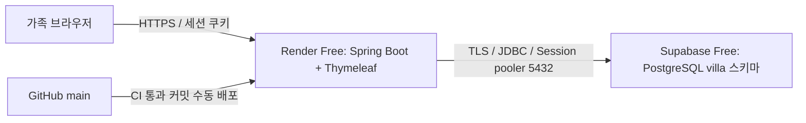

# Render Free + Supabase Free

확인일: 2026-08-31. 가족 시범 운영을 위한 무료 구성이다. 이 저장소는 배포 준비 코드를 제공하며, 커밋만으로 계정·클라우드 자원·실제 예약 데이터가 만들어지지는 않는다.

## 구성과 범위



Render Free 한 인스턴스에 화면과 서버를 함께 둔다. 두 서비스는 가능하면 Singapore에 만든다.
기존 초대·승인·세션 로그인·예약 규칙을 유지하며 Supabase Auth, Realtime, Edge Functions, Redis, 유료 도메인을 추가하지 않는다.
브라우저는 Spring만 호출한다. Supabase 키와 DB 비밀번호는 브라우저에 전달하지 않는다.

## 무료 비용 조건

| 항목 | 사용 범위 | 한도와 조치 |
| --- | --- | --- |
| Render | 무료 워크스페이스 + Free 웹 서비스 1개 | 인스턴스 시간 월 750시간을 워크스페이스 내 공유 |
| Supabase | Free 프로젝트 1개 | DB 500MB, 무료 프로젝트 계정 한도 2개 |
| 주소·HTTPS | 기본 onrender.com 주소와 관리형 TLS | 유료 도메인 구매 없음 |
| 백업 | 기존 운영자 PC | 새 유료 스토리지·유료 크론 없음 |

**무료 인스턴스 선택만으로 초과 과금이 방지되지는 않는다.** Render에 결제수단이 등록되어 있으면 전송량·빌드 초과 요금이 생길 수 있다.
무료 전용 계정/워크스페이스의 결제 상태를 먼저 확인하고 결제수단을 등록하지 않는 방식으로 운영한다. 빌드 추가 지출 한도도 0으로 둔다.
결제수단이 요구되면 무과금 조건을 확인하기 전에는 생성하지 않는다. 한도 소진 시 서비스/빌드 중단을 허용하고 자동 유료 전환하지 않는다.
계정의 결제·사용량 설정은 render.yaml로 강제할 수 없다. [Render 결제 FAQ](https://render.com/docs/faq)

Supabase는 Free 조직을 사용하고 IPv4·PITR·Pro 등 유료 옵션을 선택하지 않는다.
DB 350MB에서 정리 계획을 검토하고 450MB에서 관리자 경고를 권장한다. 이는 자체 운영 기준이다.
전송량·빌드 사용량도 대시보드에서 확인한다. [Supabase 요금](https://supabase.com/pricing)

## 1. Supabase 준비

1. 새 Free 프로젝트를 만들고 PostgreSQL 버전과 리전을 기록한다. 로컬/CI 검증 버전은 PostgreSQL 17.6이며 실제 제공 버전에서도 배포 전 스모크 테스트한다.
2. Data API를 사용하지 않으므로 대시보드에서 비활성화한다. villa 스키마를 API 노출 목록에 넣지 않는다.
3. 새 프로젝트의 SQL Editor에서 [supabase-provision.sql](../deploy/supabase-provision.sql)을 관리자 권한으로 한 번 실행한다.
   이 파일은 villa_migrator, villa_app과 전용 스키마를 만든다. 이미 존재하면 의도적으로 실패한다. 재시도를 위해 기존 데이터나 계정을 삭제하지 않는다.
4. 프로젝트 관리자 계정으로 psql에 연결한 뒤 아래 두 명령으로 강한 개별 비밀번호를 대화식 설정한다. 비밀번호를 커밋·채팅·셸 명령 인자에 넣지 않는다.

```text
\password villa_migrator
\password villa_app
```

프로비저닝 직후 두 LOGIN 역할에는 비밀번호가 없으므로 원격 비밀번호 인증은 아직 불가능하다. 각각 설정한 뒤 진행한다.
관리자 psql 접속은 Connect의 실제 Session pooler 호스트·프로젝트 관리자 계정과 암호 프롬프트를 사용한다.

앱 계정은 테이블 DML과 시퀀스 사용만 허용한다. 마이그레이션 계정은 villa 스키마를 소유한다.
anon/authenticated/PUBLIC에는 villa 접근을 허용하지 않는다. V2는 앱 계정의 Flyway 이력 테이블 권한도 회수한다.
기본 권한은 villa_migrator가 만든 객체에 적용되므로 Flyway를 postgres 관리자 계정으로 대신 실행하지 않는다.
Supabase의 다른 시스템 스키마·권한은 변경하지 않는다. [API 보안](https://supabase.com/docs/guides/api/securing-your-api)

## 2. DB 연결 설정

Supabase Connect에서 **Session pooler, 포트 5432**를 선택한다. 실제 호스트를 복사하고 custom role 사용자명은
`villa_app.PROJECT_REF`, `villa_migrator.PROJECT_REF` 형식으로 지정한다. Transaction pooler 6543이나 무료 direct IPv6 주소를 이 구성에 섞지 않는다.
Spring 영구 연결에 Session pooler를 쓰면 IPv4 애드온을 구매할 필요가 없다. [공식 연결 안내](https://supabase.com/docs/guides/database/connecting-to-postgres)

| Render 환경변수 | 값 |
| --- | --- |
| SPRING_PROFILES_ACTIVE | postgres,render |
| DB_URL | jdbc:postgresql://실제-pooler-host:5432/postgres?sslmode=require&currentSchema=villa |
| DB_USERNAME | villa_app.실제_PROJECT_REF |
| DB_PASSWORD | 앱 계정 비밀번호 |
| SPRING_FLYWAY_USER | villa_migrator.실제_PROJECT_REF |
| SPRING_FLYWAY_PASSWORD | 마이그레이션 계정 비밀번호 |
| VILLA_MAX_GUESTS | 실제 시설 정원. 0은 예약 차단 |
| BOOTSTRAP_ENABLED | 평상시 false |

비밀번호를 JDBC URL에 포함하지 않는다. `.env.example`은 참고 자료이며 Spring이 .env를 자동으로 읽지는 않는다.
최소 `sslmode=require`로 암호화를 강제한다. 서버 인증까지 검증하려면 Supabase에서 제공하는 CA를 Render Secret File로 넣고
`sslmode=verify-full&sslrootcert=/etc/secrets/실제파일명`으로 바꿔 확인한다. 인증서 오류를 이유로 평문으로 전환하지 않는다.
[Spring Boot 연결 예제](https://supabase.com/docs/guides/getting-started/quickstarts/spring-boot)

postgres 프로필은 Hikari 최대 3개·최소 유휴 0개, 연결 획득 대기 10초를 사용한다.
JPA/JDBC/Flyway 모두 villa 스키마를 사용한다. 스키마는 사전에 준비하고 JPA 자동 생성/수정은 사용하지 않는다.
Flyway는 별도 계정으로 앱 기동 시 실행한다. 따라서 DDL 자격증명도 앱 실행 환경에 존재한다는 한계가 있다.
자유게시판 테이블은 PostgreSQL V3(기존 MySQL은 V5)에서 추가된다. 기존 회원·예약은 유지되며,
정상적인 마이그레이션 계정 설정이 있다면 재배포 시 자동 적용된다. 게시판 때문에 별도 서비스나 요금제는 필요하지 않다.
배포 계정·환경변수 접근 권한을 최소화한다. 이를 완전히 분리하려면 별도 수동 마이그레이션 절차를 검증한 뒤
`SPRING_FLYWAY_ENABLED=false`로 운영하는 후속 변경이 필요하다. 빈 DB에서 먼저 끄면 앱이 기동하지 않는다.

## 3. Render 생성과 첫 관리자

1. 무료 결제 조건을 확인하고 GitHub 저장소의 Blueprint `render.yaml`로 생성한다. Free·Singapore·단일 인스턴스·Docker인지 확인한다.
2. 위 비밀 환경변수를 입력한다. 블루프린트는 무료 인스턴스만 선언하며 별도 DB·디스크·워커를 만들지 않는다.
3. 자동 배포는 꺼져 있다. GitHub CI 성공을 확인한 정확한 main 커밋을 수동 배포한다.
4. 빈 users 테이블에 최초 한 번만 `BOOTSTRAP_ENABLED=true`, `BOOTSTRAP_LOGIN_ID`, `BOOTSTRAP_PASSWORD`를 설정해 배포한다.
   비밀번호는 12자 이상, UTF-8 72바이트 이하이고 기본 비밀번호는 없다.
5. 최초 관리자 생성·로그인 성공을 확인하면 **즉시** BOOTSTRAP_ENABLED=false로 바꾸고 ID·비밀번호 환경변수를 제거해 재배포한다.
   현재 코드는 사용자가 있는 DB에서 bootstrap=true이면 안전하게 기동을 거절한다. 절전 후 재기동 전에 반드시 해제해야 한다.
6. 실제 정원을 VILLA_MAX_GUESTS에 넣은 뒤 예약을 연다. Blueprint를 다시 동기화하면 파일의 안전 기본값 0으로 돌아갈 수 있으므로 운영 값을 확인한다.

Docker 이미지는 비관리자 UID로 실행한다. Render에는 힙 256MB, 작은 코드 캐시, 요청 스레드 24개를 초기값으로 둔다.
힙 제한은 전체 프로세스 메모리 제한과 다르다. 실제 Free 512MB 인스턴스의 RSS·기동 시간·동시 요청을 확인해야 한다.
무료 CPU에서 동작이 너무 느리거나 메모리 부족이 나면 기능·동시성 제한을 조정하며 유료 업그레이드하지 않는다.
[Render Blueprint 사양](https://render.com/docs/blueprint-spec)

## 프록시·세션·헬스 체크

render 프로필은 Tomcat native 전달 헤더 처리를 사용한다. 기본 신뢰 프록시는 10.x.x.x 사설 주소만이다.
실제 Render 프록시 홉이 다르면 확인한 범위만 TRUSTED_PROXY_REGEX로 설정한다. 모든 주소를 신뢰하는 `.*`는 사용하지 않는다.
X-Forwarded-For를 필터에서 직접 읽지 않고 검증된 remoteAddr로 요청 제한을 적용한다.
인터넷에서 임의 X-Forwarded-For를 보내 제한이 우회되지 않는지, 정상 사용자 두 명의 제한이 합산되지 않는지 실제 배포에서 확인한다.
TLS 종료 뒤 Secure 쿠키와 HTTPS 스킴 인식도 확인한다. 로컬 HTTP는 render 프로필을 빼고 COOKIE_SECURE=false로만 시험한다.

- `/health`: 생존 응답. Render 기본 헬스 체크로 사용하여 DB 장애 때문에 불필요한 재시작이 반복되지 않게 한다.
- `/health/ready`: 앱 계정으로 DB 잠금 행을 조회한다. 정상 200, 연결·스키마·권한 오류 503. 세부 DB 정보와 비밀은 응답하지 않는다.
- 메모리 세션·요청 제한은 단일 JVM용이다. 절전·배포·재시작 후 재로그인하며 DB 예약 기록은 남는다. 여러 인스턴스로 늘리지 않는다.

## DB 전환과 검증

기존 `db/migration`의 MySQL V1~V4 및 Java V3는 그대로 보존한다.
PostgreSQL은 `db/postgresql`의 새 V1에서 최종 스키마를 만들고 V2에서 Flyway 이력을 보호한다.
빈 PostgreSQL DB에는 옛 초대코드가 없으므로 MySQL용 Java V3를 실행하지 않는다.
기존 MySQL 데이터를 자동 복사하거나 baseline하지 않는다.

MySQL 데이터가 있다면 별도 복원본에서 계정 PK·BCrypt 해시·예약 FK·날짜 점유·초대코드 해시를 유지하는 변환을 설계한다.
시간 저장 의미(UTC)와 로그인 ID 정규화, PostgreSQL identity 시퀀스 재설정도 확인한다.
서로 다른 DB의 Flyway 이력 테이블을 복사하지 않는다. 원본 백업을 보관하고 최종 쓰기 중지 후 대조하는 이전 절차가 필요하다.

CI는 PostgreSQL과 MySQL에서 UTC·Asia/Seoul 조합을 검사한다.
PostgreSQL CI는 실제 운영과 같은 앱/마이그레이션 권한 분리를 사용하고,
동시 예약 20건·초대 10건·중복 제출·실패 롤백·날짜 PK·권한·세션 회수·시간 보존을 검증한다.
H2 테스트만으로 PostgreSQL 검증이 끝났다고 간주하지 않는다.

테스트는 데이터를 초기화하므로 localhost의 이름이 `villa_test`인 DB만 허용한다. 운영 URL을 테스트용으로 넣지 않는다.
Docker 로컬 실행은 README를 따른다. Windows PowerShell 예:

```powershell
docker compose -f compose.postgres.yaml up -d --wait
$env:TEST_DB_URL = 'jdbc:postgresql://127.0.0.1:55432/villa_test'
$env:TEST_DB_USERNAME = 'villa_test'
$env:TEST_DB_PASSWORD = 'local-test-only'
$env:TEST_TIME_ZONE = 'Asia/Seoul'
.\gradlew.bat test --rerun-tasks
docker compose -f compose.postgres.yaml down
```

이 컨테이너에는 영구 볼륨이 없으며 마지막 down은 테스트 데이터도 제거한다.

## 절전·용량·백업

Render Free는 15분 무요청 후 절전하고 다음 요청으로 기동하는 데 약 1분이 걸릴 수 있다.
Supabase는 최근 7일 활동이 적으면 일시정지할 수 있으며 운영자가 대시보드에서 Resume해야 한다.
DB가 멈췄을 때 앱을 깨우는 것만으로 복구되지는 않는다. 절전 방지용 주기 호출은 만들지 않는다.
무료 한도 초과 시 서비스·빌드가 중단될 수 있으며 항상 이용 가능한 예약 서비스로 약속하지 않는다.
[Render Free 제한](https://render.com/docs/free) · [Supabase 일시정지](https://supabase.com/docs/guides/platform/free-project-pausing)

백업은 운영자 PC에서 하루 1회와 스키마 변경 전에 수행하고 최근 7개를 보관하는 운영 목표다.
자동화는 제공하지 않는다. PC가 꺼져 있거나 실행을 놓치면 목표를 충족하지 못한다.
서비스에 상주 크론을 넣지 않는다. Render 로컬 디스크는 영구 보관 장소가 아니다.

로컬에 서버 버전 이상인 PostgreSQL 클라이언트를 준비하고, 비밀번호는 -W 프롬프트로 입력한다.
관리자 또는 읽기 가능한 백업 계정으로 `pg_dump --format=custom --schema=villa --no-owner --no-privileges`를 사용한다.
호스트·포트·DB·사용자·출력 파일은 실제 접속 정보로 지정하고 Session pooler 5432 또는 도달 가능한 direct 연결을 쓴다.
DB 밖의 역할·권한은 이 덤프에 포함되지 않으므로 프로비저닝 SQL과 역할 복원 절차도 보관한다.
덤프는 즉시 암호화해 접근 제한된 기존 디스크에 보관하고 암호화가 검증될 때까지 원본을 지우지 않는다.
공개 저장소나 GitHub Actions 아티팩트에 회원 데이터 덤프를 올리지 않는다. [Supabase 백업 안내](https://supabase.com/docs/guides/platform/backups)

월 1회 다른 빈 로컬 DB에 역할·권한을 준비하고 villa_migrator 소유로 복원해 회원·예약·점유·이력 수와 실제 로그인·예약을 대조한다.
앱 계정의 Flyway 이력 쓰기 권한도 다시 회수한다. 삭제 이력이 있다면 재적용한다.
실제 마지막 검증 백업이 복구 기준이며 RPO 1시간·무중단 복구를 보장하지 않는다.
예약 결과가 불확실할 때는 내 예약을 조회하고 같은 요청 키로 재시도한다. 임시 연락만으로 예약 확정하지 않는다.
앱 이미지 롤백과 DB 복원은 별도 작업이며 새 예약이 유실될 수 있는 복원을 자동 실행하지 않는다.

## 실제 공개 전 남은 확인

- 계정 연결·비밀 환경변수·DB TLS 접속과 제공 PostgreSQL 버전 확인
- 실제 시설 정원, 관리자 연락 경로와 개인정보 보관·삭제 절차 확인
- Render에서 기동·절전 후 복귀·프록시 IP·Secure 쿠키·메모리 확인
- DB 일시정지·장애 시 503과 관리자 복구, 실제 백업 복원 확인
- 계정 결제수단·무료 사용량·추가 지출 차단 확인
