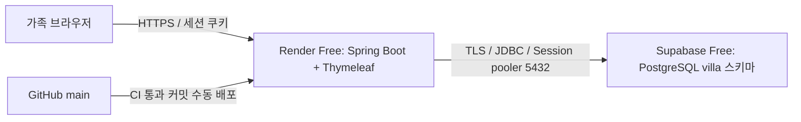

# Kangsph 무료 배포 구성과 운영 절차

Kangsph를 비용 부담 없이 가족용으로 시범 운영하기 위해 **Render Free + Supabase Free PostgreSQL**을 사용하는 배포 설정을 구성했습니다.
이 문서에는 제가 선택한 배포 구조와 DB 권한 설계, 초기 설정, 백업 및 장애 대응 절차를 정리했습니다.

저장소의 배포 설정과 실제 환경에서 확인해야 할 항목을 구분해 관리합니다. 계정 생성, 비밀값 설정, 실제 배포와 복원 검증은 아래 절차에 따라 별도로 진행합니다.

무료 플랜 정보 기준일은 **2026-08-31**입니다. 한도와 과금 정책은 실제 배포 시 공식 문서와 계정 대시보드에서 다시 확인합니다.

## 배포 구조



화면과 서버를 함께 운영할 수 있도록 Render Free 인스턴스 하나에 Spring Boot와 Thymeleaf를 배치하는 구조로 정했습니다.
Render와 Supabase는 가능한 한 Singapore 리전에 구성합니다.

기존 초대코드·관리자 승인·세션 로그인·예약 규칙을 유지하고, Supabase는 PostgreSQL DB로 사용합니다.
Supabase Auth, Realtime, Edge Functions, Redis와 유료 도메인은 구성에 포함하지 않았습니다.
브라우저는 Spring 서버만 호출하며, Supabase 키와 DB 비밀번호가 브라우저에 전달되지 않도록 구성했습니다.

## 비용과 사용량 관리 기준

가족 시범 운영에서는 유료 기능을 추가하기보다 무료 한도 안에서 운영하는 것을 기준으로 정했습니다.
한도를 소진하면 서비스나 빌드 중단을 허용하며 자동으로 유료 플랜으로 전환하지 않습니다.

| 항목 | 사용 범위 | 기준일 당시 한도와 운영 방식 |
| --- | --- | --- |
| Render | 무료 워크스페이스 + Free 웹 서비스 1개 | 인스턴스 시간 월 750시간을 워크스페이스 내 공유 |
| Supabase | Free 프로젝트 1개 | DB 500MB, 무료 프로젝트 계정 한도 2개 |
| 주소·HTTPS | 기본 onrender.com 주소와 관리형 TLS | 유료 도메인 구매 없음 |
| 백업 | 운영자 PC | 별도 유료 스토리지·유료 크론 없음 |

**무료 인스턴스를 선택하는 것만으로 초과 과금이 차단되지는 않습니다.**
Render에 결제수단이 등록되어 있으면 전송량·빌드 초과 요금이 발생할 수 있어, 무료 전용 계정·워크스페이스의 결제 상태를 먼저 확인합니다.
결제수단을 등록하지 않고 빌드 추가 지출 한도를 0으로 두는 방식으로 운영 기준을 정했습니다.
결제수단 등록이 요구되는 경우에는 무과금 조건을 확인하기 전까지 자원을 생성하지 않습니다.
계정의 결제·사용량 설정은 `render.yaml`로 강제할 수 없으므로 대시보드에서 별도로 관리합니다.

Supabase는 Free 조직을 사용하고 IPv4 애드온, PITR, Pro 등 유료 옵션은 선택하지 않습니다.
DB 사용량 350MB에서 정리 계획을 검토하고, 450MB에서 관리자에게 알리는 것을 자체 운영 기준으로 정했습니다.
이 수치는 서비스 제공사의 제한이 아니며, 자동 경고 기능을 구현했다는 의미도 아닙니다. 전송량과 빌드 사용량도 대시보드에서 확인합니다.

관련 문서: [Render 결제 FAQ](https://render.com/docs/faq), [Supabase 요금](https://supabase.com/pricing)

## 1. Supabase 초기 설정

앱 실행 계정과 스키마 변경 계정을 분리하도록 구성했습니다.
앱 계정에는 서비스에 필요한 데이터 접근 권한만 부여하고, Flyway는 별도 마이그레이션 계정으로 실행합니다.

1. 새 Free 프로젝트를 생성하고 PostgreSQL 버전과 리전을 기록합니다. 로컬·CI 검증 버전은 PostgreSQL 17.6이며, 실제 제공 버전에서도 배포 전 기본 동작을 확인합니다.
2. 사용하지 않는 Data API는 대시보드에서 비활성화하고, `villa` 스키마를 API 노출 목록에 추가하지 않습니다.
3. 새 프로젝트의 SQL Editor에서 [supabase-provision.sql](../deploy/supabase-provision.sql)을 관리자 권한으로 한 번 실행합니다. 이 파일은 `villa_migrator`, `villa_app` 역할과 전용 스키마를 생성합니다. 이미 존재하면 실패하도록 작성했으므로, 재실행을 위해 기존 데이터나 계정을 삭제하지 않습니다.
4. 프로젝트 관리자 계정으로 psql에 연결한 뒤 아래 명령으로 두 계정의 강한 개별 비밀번호를 대화식으로 설정합니다. 비밀번호는 커밋·채팅·셸 명령 인자에 넣지 않습니다.

```text
\password villa_migrator
\password villa_app
```

프로비저닝 직후에는 두 LOGIN 역할에 비밀번호가 없어 원격 비밀번호 인증을 할 수 없습니다. 각 계정의 비밀번호를 설정한 뒤 다음 단계로 진행합니다.
관리자 psql 연결에는 Supabase Connect에 표시된 실제 Session pooler 호스트, 프로젝트 관리자 계정, 암호 입력 프롬프트를 사용합니다.

권한은 다음과 같이 구분했습니다.

| 대상 | 권한 구성 |
| --- | --- |
| `villa_app` | 서비스 테이블 DML과 시퀀스 사용 |
| `villa_migrator` | `villa` 스키마 소유 및 마이그레이션 |
| `anon` / `authenticated` / `PUBLIC` | `villa` 접근 불허 |

PostgreSQL V2 마이그레이션에서는 앱 계정의 Flyway 이력 테이블 권한도 회수합니다.
기본 권한은 `villa_migrator`가 만든 객체에 적용되므로, Flyway를 `postgres` 관리자 계정으로 대신 실행하지 않습니다.
Supabase의 다른 시스템 스키마와 권한은 변경하지 않습니다.

관련 문서: [Supabase API 보안](https://supabase.com/docs/guides/api/securing-your-api)

## 2. DB 연결과 환경변수

DB 연결은 **Session pooler, 포트 5432**를 사용하도록 정했습니다.
Spring의 지속적인 DB 연결에 Session pooler를 사용해 별도 IPv4 애드온 없이 연결하는 구성입니다.

Supabase Connect에서 실제 호스트를 복사하고, custom role 사용자명은 `villa_app.PROJECT_REF`, `villa_migrator.PROJECT_REF` 형식으로 지정합니다.
Transaction pooler 6543이나 무료 direct IPv6 주소를 이 설정에 혼용하지 않습니다.

| Render 환경변수 | 값 |
| --- | --- |
| `SPRING_PROFILES_ACTIVE` | `postgres,render` |
| `DB_URL` | `jdbc:postgresql://실제-pooler-host:5432/postgres?sslmode=require&currentSchema=villa` |
| `DB_USERNAME` | `villa_app.실제_PROJECT_REF` |
| `DB_PASSWORD` | 앱 계정 비밀번호 |
| `SPRING_FLYWAY_USER` | `villa_migrator.실제_PROJECT_REF` |
| `SPRING_FLYWAY_PASSWORD` | 마이그레이션 계정 비밀번호 |
| `VILLA_MAX_GUESTS` | 실제 시설 정원. `0`이면 예약 차단 |
| `BOOTSTRAP_ENABLED` | 평상시 `false` |

비밀번호는 JDBC URL에 포함하지 않고 Render의 비밀 환경변수로 관리합니다.
`.env.example`은 설정 참고용이며 Spring이 `.env` 파일을 자동으로 읽는 것은 아닙니다.

DB 통신은 최소 `sslmode=require`로 암호화합니다.
서버 인증서까지 검증하는 경우에는 Supabase에서 제공하는 CA를 Render Secret File에 등록하고, 연결 옵션을 `sslmode=verify-full&sslrootcert=/etc/secrets/실제파일명`으로 변경해 확인합니다.
인증서 오류가 발생하더라도 평문 연결로 전환하지 않습니다.

`postgres` 프로필의 Hikari 연결 풀은 최대 3개, 최소 유휴 0개, 연결 획득 대기 10초로 설정했습니다.
JPA·JDBC·Flyway가 모두 `villa` 스키마를 사용하며, 스키마는 사전에 준비하고 JPA의 자동 생성·수정은 사용하지 않습니다.

Flyway는 앱 기동 시 별도 계정으로 실행합니다. 따라서 스키마 변경 권한이 있는 자격증명도 앱 실행 환경에 존재한다는 한계가 있습니다.
배포 계정과 환경변수에 접근할 수 있는 권한을 최소화하는 방식으로 관리합니다.
마이그레이션 실행을 완전히 분리하려면 별도 수동 절차를 검증한 뒤 `SPRING_FLYWAY_ENABLED=false`로 전환하는 후속 작업이 필요합니다. 빈 DB에서 먼저 비활성화하면 앱이 기동하지 않습니다.

자유게시판 테이블은 PostgreSQL V3, 기존 MySQL V5 마이그레이션에서 추가했습니다.
기존 회원·예약 데이터는 유지하며, 마이그레이션 계정이 정상적으로 설정되어 있으면 재배포 시 적용됩니다. 게시판 운영에 별도 서비스나 요금제는 필요하지 않습니다.

관련 문서: [Supabase DB 연결](https://supabase.com/docs/guides/database/connecting-to-postgres), [Spring Boot 연결 예제](https://supabase.com/docs/guides/getting-started/quickstarts/spring-boot)

## 3. Render 생성과 최초 관리자 설정

1. 무료 결제 조건을 확인한 뒤 GitHub 저장소의 Blueprint `render.yaml`로 서비스를 생성합니다. Free 플랜, Singapore 리전, 단일 인스턴스, Docker 실행인지 확인합니다.
2. 앞서 정리한 환경변수와 비밀값을 입력합니다. Blueprint는 무료 웹 인스턴스만 선언하며 별도 DB·디스크·워커를 생성하지 않습니다.
3. 자동 배포는 비활성화했습니다. GitHub CI가 성공한 정확한 `main` 커밋을 선택해 수동 배포합니다.
4. `users` 테이블이 비어 있는 최초 실행에서만 `BOOTSTRAP_ENABLED=true`, `BOOTSTRAP_LOGIN_ID`, `BOOTSTRAP_PASSWORD`를 설정합니다. 관리자 비밀번호는 12자 이상, UTF-8 72바이트 이하이며 기본 비밀번호는 없습니다.
5. 관리자 생성과 로그인을 확인하면 **즉시 `BOOTSTRAP_ENABLED=false`로 변경하고 ID·비밀번호 환경변수를 제거한 뒤 재배포합니다.** 사용자가 있는 DB에서 bootstrap이 활성화되어 있으면 기동을 거절하도록 구현했으므로, 절전 후 재기동 전에도 이 설정을 해제해야 합니다.
6. `VILLA_MAX_GUESTS`에 실제 정원을 입력한 뒤 예약을 받습니다. Blueprint를 다시 동기화하면 안전 기본값 `0`으로 돌아갈 수 있으므로 운영 값을 확인합니다.

Docker 이미지는 비관리자 UID로 실행하도록 구성했습니다.
Render 환경에는 힙 256MB, 작은 코드 캐시, 요청 스레드 24개를 초기값으로 설정했습니다.
힙 제한과 전체 프로세스 메모리 사용량은 다르므로 실제 Free 512MB 인스턴스의 RSS, 기동 시간, 동시 요청 처리는 배포 후 확인합니다.
무료 CPU에서 응답이 지나치게 느리거나 메모리가 부족하면 기능과 동시성 제한을 조정하는 것을 우선하며, 유료 업그레이드는 운영 범위에 포함하지 않았습니다.

관련 문서: [Render Blueprint 사양](https://render.com/docs/blueprint-spec)

## 프록시·세션·헬스 체크

`render` 프로필은 Tomcat native 전달 헤더 처리를 사용하도록 구성했습니다.
기본 신뢰 프록시 범위는 `10.x.x.x` 사설 주소이며, 실제 Render 프록시 홉이 다르면 확인한 범위만 `TRUSTED_PROXY_REGEX`에 설정합니다. 모든 주소를 신뢰하는 `.*`는 사용하지 않습니다.

요청 제한은 필터에서 `X-Forwarded-For`를 직접 읽지 않고 검증된 `remoteAddr`를 기준으로 적용합니다.
실제 배포에서는 임의의 `X-Forwarded-For`로 제한을 우회할 수 없는지, 서로 다른 정상 사용자의 요청이 같은 주소로 합산되지 않는지 확인합니다.
TLS 종료 뒤에도 Secure 쿠키와 HTTPS 스킴을 올바르게 인식하는지 점검합니다. 로컬 HTTP 테스트에서는 `render` 프로필을 제외하고 `COOKIE_SECURE=false`를 사용합니다.

| 경로 | 목적과 응답 |
| --- | --- |
| `/health` | 프로세스 생존 확인. Render 기본 헬스 체크로 사용 |
| `/health/ready` | 앱 계정으로 DB 잠금 행 조회. 정상 `200`, 연결·스키마·권한 오류 `503` |

DB 장애가 불필요한 앱 재시작으로 이어지지 않도록 생존 확인과 DB 준비 상태 확인을 분리했습니다.
헬스 체크 응답에는 상세 DB 정보나 비밀값을 포함하지 않습니다.

세션과 요청 제한은 단일 JVM 메모리에서 관리합니다. 절전·배포·재시작 후에는 다시 로그인해야 하지만 DB의 예약 기록은 유지됩니다.
현재 구성에서는 앱 인스턴스를 여러 개로 늘리지 않습니다.

## DB 전환과 검증

기존 `db/migration`의 MySQL V1~V4 및 Java V3 마이그레이션은 보존했습니다.
PostgreSQL은 `db/postgresql`의 새 V1에서 초기 스키마를 생성하고, V2에서 Flyway 이력을 보호하며, V3에서 게시판 테이블을 추가합니다.
빈 PostgreSQL DB에는 기존 초대코드가 없으므로 MySQL용 Java V3는 실행하지 않습니다.
기존 MySQL 데이터를 자동으로 복사하거나 baseline하는 기능은 포함하지 않았습니다.

기존 MySQL 데이터를 옮길 때는 별도 복원본에서 다음 항목을 확인하는 절차로 정리했습니다.

- 계정 PK, BCrypt 해시, 예약 FK, 날짜 점유, 초대코드 해시 보존
- UTC 기준 시각의 저장 의미와 로그인 ID 정규화
- PostgreSQL identity 시퀀스 재설정
- DB별 Flyway 이력 분리. MySQL의 이력 테이블을 PostgreSQL로 복사하지 않음
- 원본 백업 보관 및 최종 쓰기 중지 후 데이터 대조

CI에서는 PostgreSQL과 MySQL을 각각 UTC·Asia/Seoul JVM 시간대에서 검증하도록 구성했습니다.
PostgreSQL CI에도 앱 계정과 마이그레이션 계정의 권한 분리를 적용했습니다.
동시 예약 20건, 동시 초대 사용 10건, 중복 제출, 실패 롤백, 날짜 PK, 접근 권한, 세션 회수, 저장 시각 보존을 검증 대상으로 두었습니다.
H2 테스트와 별도로 실제 PostgreSQL 통합 테스트를 수행합니다.

**통합 테스트는 데이터를 초기화합니다. 운영 DB URL을 입력하지 않습니다.**
테스트 실행기는 localhost의 `villa_test` DB만 허용하도록 제한했습니다.
Docker를 사용하는 Windows PowerShell 실행 예시는 다음과 같습니다.

```powershell
docker compose -f compose.postgres.yaml up -d --wait
$env:TEST_DB_URL = 'jdbc:postgresql://127.0.0.1:55432/villa_test'
$env:TEST_DB_USERNAME = 'villa_test'
$env:TEST_DB_PASSWORD = 'local-test-only'
$env:TEST_TIME_ZONE = 'Asia/Seoul'
.\gradlew.bat test --rerun-tasks
docker compose -f compose.postgres.yaml down
```

위 컨테이너에는 영구 볼륨이 없으며 마지막 `down` 명령은 테스트 데이터도 제거합니다.
다른 로컬 실행 예시는 [README](../README.md)에 정리했습니다.

## 절전·용량·백업

### 무료 환경의 제약

기준일 당시 Render Free는 15분 동안 요청이 없으면 절전하며, 다음 요청으로 기동하는 데 약 1분이 걸릴 수 있습니다.
Supabase는 최근 7일 동안 활동이 적으면 일시정지할 수 있고, 이 경우 운영자가 대시보드에서 Resume해야 합니다.
DB가 멈춘 상태에서는 앱만 깨워도 서비스가 복구되지 않습니다.

절전 방지용 주기 호출은 구성하지 않았습니다.
무료 한도 초과 시 서비스·빌드가 중단될 수 있다는 점을 운영 제약으로 두고, 상시 이용을 보장하는 서비스로 운영하지 않습니다.

관련 문서: [Render Free 제한](https://render.com/docs/free), [Supabase 일시정지](https://supabase.com/docs/guides/platform/free-project-pausing)

### 백업 기준

운영자 PC에서 **하루 1회와 스키마 변경 전 백업, 최근 7개 보관**을 목표로 정했습니다.
백업 자동화는 구현 범위에 포함하지 않았으므로 PC가 꺼져 있거나 실행을 놓치면 이 목표를 충족하지 못합니다.
서비스에 상주 크론을 추가하지 않으며, Render 로컬 디스크도 영구 백업 장소로 사용하지 않습니다.

백업 절차는 다음과 같습니다.

1. 로컬에 DB 서버 버전 이상인 PostgreSQL 클라이언트를 준비합니다.
2. 관리자 또는 읽기 가능한 백업 계정으로 `pg_dump --format=custom --schema=villa --no-owner --no-privileges`를 사용합니다. 비밀번호는 `-W` 프롬프트에서 입력합니다.
3. 호스트·포트·DB·사용자·출력 파일은 실제 접속 정보로 지정하고, Session pooler 5432 또는 도달 가능한 direct 연결을 사용합니다.
4. 덤프에 포함되지 않는 DB 외부 역할·권한은 프로비저닝 SQL과 역할 복원 절차로 따로 보관합니다.
5. 덤프를 즉시 암호화해 접근이 제한된 기존 디스크에 보관합니다. 암호화가 검증될 때까지 원본은 삭제하지 않습니다.

회원 데이터 덤프는 공개 저장소나 GitHub Actions 아티팩트에 올리지 않습니다.

관련 문서: [Supabase 백업 안내](https://supabase.com/docs/guides/platform/backups)

### 복원과 예약 확인

월 1회 다른 빈 로컬 DB에 역할·권한을 준비하고 `villa_migrator` 소유로 복원하는 것을 검증 절차로 정했습니다.
회원·예약·날짜 점유·이력 건수를 대조하고 실제 로그인과 예약까지 확인합니다.
복원 후 앱 계정의 Flyway 이력 쓰기 권한을 다시 회수하고, 개인정보 삭제 이력이 있으면 재적용합니다.

복구 기준은 마지막으로 검증한 실제 백업입니다. 무료 구성에서 RPO 1시간이나 무중단 복구를 보장하지 않습니다.
예약 결과가 불확실하면 내 예약을 조회하고 같은 요청 키로 재시도합니다. 메신저 등으로 임시 접수한 내용만으로 예약을 확정하지 않습니다.

앱 이미지 롤백과 DB 복원은 별도 작업으로 다룹니다.
복원 시점 이후의 예약이 유실될 수 있으므로 DB 복원은 자동으로 실행하지 않습니다.

## 실제 공개 전 확인 항목

아래 항목은 코드 구현과 별도로 실제 환경에서 확인해야 할 작업으로 관리합니다.

- 계정 연결, 비밀 환경변수, DB TLS 접속, 실제 제공 PostgreSQL 버전
- 시설 정원, 관리자 연락 경로, 개인정보 보관·삭제 절차
- Render 기동과 절전 후 복귀, 프록시 IP, Secure 쿠키, 메모리 사용량
- DB 일시정지·장애 시 `503` 응답과 관리자 복구 절차
- 실제 백업 복원과 데이터·권한 대조
- 계정 결제수단, 무료 사용량, 추가 지출 차단 설정
